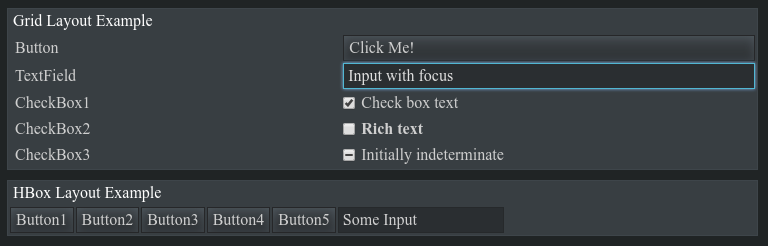

XUI - eXtensible UI
===================

XUI is an experimental UI toolkit that provides a component-based architecture relying on recent web technologies. The idea is to create a toolkit that is similar to other component-based UI toolkits (not template-based ones), but without all the legacy burden they were built on.

XUI is a toy project at the moment that is not finished nor intended for production use; its purpose is to experiment with using modern web technologies to create a next-generation component-based UI toolkit.

The following technologies are used by XUI extensively:

  * Class object model is based on `xmo.js` extented to support concepts like properties.
  * Code is using ES6 with no polyfills nor ES5 workarounds, but classes rely on `xmo.js`.
  * Layout engine relyes on CSS Grid and FlexBox at the moment, no custom layouts at the moment.
  * Currently the toolkit uses CSS-based themes, which are easy to create and update.
  * One DOM element per UI component, and one or two elements per UI container.

Planned technologies to use:

  * ResizeObserver for onResize events (only supported by Blink atm).

Technologies / concepts avoided in core library:

  * Avoid templates and template-parsers.
  * Avoid jQuery-style selectors to manipulate DOM.

TODO
----

  * [ ] Fix MenuBar and menu components.
  * [ ] Fix ToolBar and tool components.
  * [ ] Add anonymous components.
  * [ ] Add TabView and TabPage.
  * [ ] Add TreeView and TreeItem components.
  * [ ] Add ComboBox components.
  * [ ] Add Window and Dialog components.

Sample code
-----------

The following snippet uses a component builder to create UI:

```html
<html>
<head>
  <link href="./reset.css" rel="stylesheet" />
  <link href="./xui.css" rel="stylesheet" />
  <script src="./xmo.js"></script>
  <script src="./xui.js"></script>
</head>

<body id="page"></body>

<script>
(function() {
  "use strict";

  // Build UI components by using a built-in UI builder. No
  // documentation should be needed to understand what it does.
  const ui = xui.new({
    type: "root",
    layout: {
      type: "vbox",
      gap: 10
    },
    padding: 10,
    children: [
      {
        type: "panel",
        text: "Grid Layout Example",
        collapsible: true,
        padding: 2,
        layout: {
          type: "grid",
          rowGap: 2,
          columnGap: 2,
          columnCount: 2,
          justify: "stretch",
          alignment: "center"
        },
        children: [
          { type: "text"     , text: "Button" },
          { type: "button"   , text: "Click Me!" },
          { type: "text"     , text: "TextField" },
          { type: "textfield", placeholder: "Placeholder" },
          { type: "text"     , text: "CheckBox1" },
          { type: "checkbox" , value: true, text: "Check box text" },
          { type: "text"     , text: "CheckBox2" },
          { type: "checkbox" , value: false, html: "<b>Rich text</b>" },
          { type: "text"     , text: "CheckBox3" },
          { type: "checkbox" , value: 2, text: "Initially indeterminate" }
        ]
      },
      {
        type: "panel",
        text: "HBox Layout Example",
        collapsible: true,
        layout: {
          type: "hbox",
          justify: "stretch",
          gap: 2
        },
        padding: 2,
        children: [
          { type: "button"   , text : "Button1" },
          { type: "button"   , text : "Button2" },
          { type: "button"   , text : "Button3" },
          { type: "button"   , text : "Button4" },
          { type: "button"   , text : "Button5" },
          { type: "textfield", value: "Some Input" }
        ]
      }
    ]
  });

  ui.attachToBody();
})();
</script>
</html>
```

When executed it creates the following UI:



XUI Core
--------

XUI is divided into the following core concepts:

  * `Mixin` - Mixin that extends classes with properties and other features used by XUI.
  * `Class` - Base class for everything, uses `Mixin` internally and provides reflection, property system, and core event handling.
  * `ClassRegistry` - Maps classes to fullnames like "xui.Button" and shortnames like "button".
  * `Global` - Global object wrapping browser globals.
  * `Layout` - Used by containers to position its children.
  * `Component` - Base UI component that wraps a single DOM element.
  * `Container` - Base UI container that allows to insert components into it.
  * `Composite` - Container that uses another `Container` component to manage its children. It allows to create components such as `Panel` and `TabView` that display their children inside a private container.


Contributions
-------------

Contribution to XUI means that you have read and agreed with its license and that you provide the contribution under the same license as XUI itself.

XUI is open for contributions and fresh ideas, however, the design of core components is more important than adding new ones. This means that contributions that make XUI better without introducing new components are preferred over contributions that add new half-working components.

License
-------

XUI is Zlib licensed, see [LICENSE.md](./LICENSE.md).
